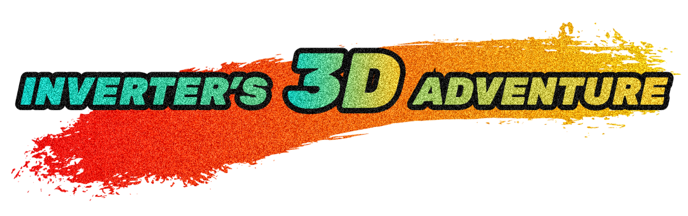
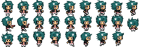
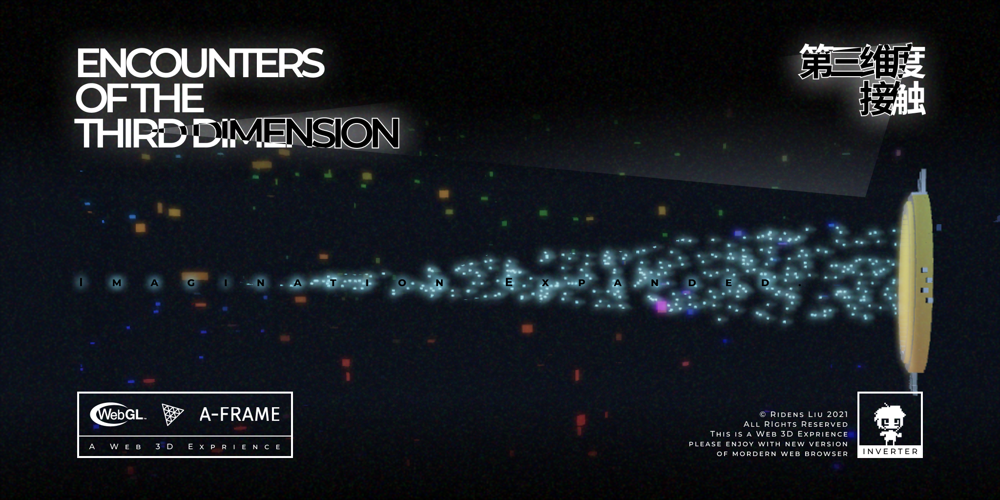
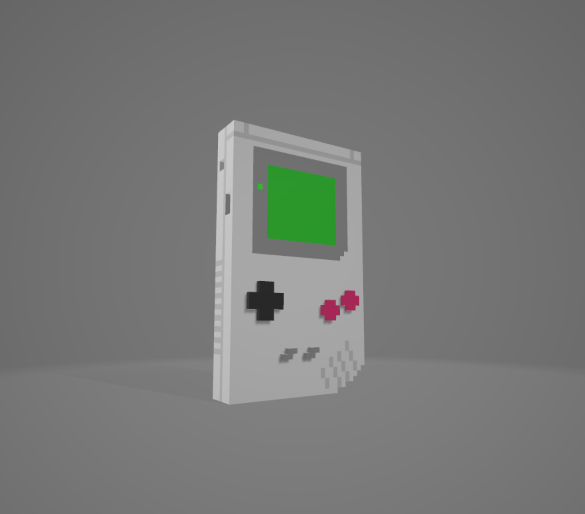
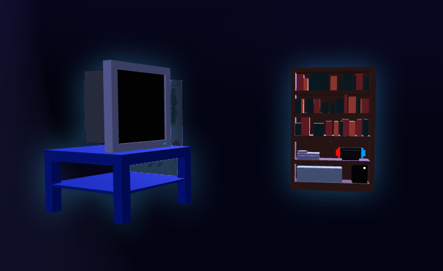

# Description of Final Project

---

# "Inverter's 3D Adventure"




## Who's inverter?

Inverter is a 2D pixel character I created when I and my friends developed a 2D graphic adventure game.



character design using Aseprite

After learning how to use 3D scene creation this semester, I came up with this idea in my mind: why don't you try to give this 2d character the life of 3d space, in other words, design an adventure journey in 3d space for him.


## Final Outcome : Link of Video

[https://youtu.be/rQW9HYPjNBs](https://youtu.be/rQW9HYPjNBs)




## TRY it!

[https://butternut-aware-louse.glitch.me](https://butternut-aware-louse.glitch.me)

(Sometimes the sound entity may crash... try it a bit more)


## Source Code

Github Link:

[https://git.arts.ac.uk/21030441/Advanced-Creative-Coding-One/tree/master/Final Project](https://git.arts.ac.uk/21030441/Advanced-Creative-Coding-One/tree/master/Final Project)

Glitch Link:

[https://glitch.com/edit/#!/butternut-aware-louse](https://glitch.com/edit/#!/butternut-aware-louse)


## Step1：Create Charactor

### **Generate a 32*32 "Pixel" matrix:** 

I developed this project using `A- Frame` framework. In order to generate such a large number of boxes, I used A- Frame `component` features to create `scene-flow` components for `a-scene` and write js code in the components  (In A-frame, the common practice for generating objects is to do this in html). In this way, not only can a large number of "particles" be easily realized, but also different size and color can be defined for each particle.

```JavaScript
for (let i = 0; i < 32; i++) {
      const boxList = []
      
      for (let j = 0; j < 32; j++) {
        const el = document.createElement('a-box')//create new boxes
        boxList.push(el)
        
        el.setAttribute('position', `${ (i - 16) / 10 } ${ (j - 16) / 10 + 2 } -55`)

        const size = 0.07
        el.setAttribute('width', size)
        el.setAttribute('height', size)
        el.setAttribute('depth', size)
        
        el.setAttribute('color', `hsl(${ Math.sqrt(i * i + j * j) * 1.5 }, 100%, 70%)`)
      }
}
```


### **Add the data information for each "Pixel":** 

The image data I used for the pixel sprite was read from a png file using HTML5 canvas and it's 2D context function. 

It was then loaded into a JSON file, which will be downloaded asynchronously during runtime via HTML 5 fetch API.

```JavaScript
const init = async () => {
  const data = await fetch('data.json')
  const text = await data.text()
  document.querySelector('a-scene').setAttribute('scene-flow', { imgdata: text })
}

```


The 3D pixels will be replaced by the character sprite as soon as the data loaded.

```JavaScript
this.pixelInfo = JSON.parse(this.data.imgdata)
      
for (let i = 0; i < 32; i++) {
  for (let j = 0; j < 32; j++) {
    const info = this.pixelInfo[i][j]
    this.boxes[j][31 - i].setAttribute('color', `rgba(${ info[0] }, ${ info[1] }, ${ info[2] }, ${ info[3] })`)
  }
}
```


## Step2: Add animation for "pixels"

The next step is to make pixels run in 3d space by adding animation.

> In my opinion, these 2d pixels that we see through the screen actually exist in the form of various data particles in their own **game dimensions** . Therefore, I want to realize a process of particles from screen pixels to disordered space particles, and then converge from particles into images on the screen, so as to open up the boundary between virtual and reality, link the two together, and also symbolize the birth process of **inverter** .


### **set delay param for animation** 

Here uses an algorithm for generating circular waves, which is used to gradually move the pixel map from the middle to both sides.

```JavaScript
const dist = Math.sqrt(Math.pow(i - 16, 2) + Math.pow(j - 16, 2) )
```


### **position animation** 

The effect of "diffusion-recombination" is achieved by changing the z-axis position of each pixel.

```JavaScript
//position animation
el.setAttribute('animation__pos', {
  property: 'object3D.position.z',
  to: Math.random() * 80.5 + 1.5,
  dur: 5000,
  dir: 'alternate',
  loop: true,
  delay: dist * 100,
})
```


### **rotation animation** 

Adding rotating animation to enrich motion details.

```JavaScript
//rotation animation
el.setAttribute('animation__rot', {
  property: 'rotation',
  to: '0 360 360',
  dur: 2500,
  loop: true,
  delay: dist * 500,
})
```


## Step 3: Enrich the scene

### **Add gameboy model** 


This one I used the model found from sketchfab, converted it into glb format and imported it into the scene.

Here is the origin model:

[https://skfb.ly/oqCJI](https://skfb.ly/oqCJI)




```HTML
<a-gltf-model
  src="https://cdn.glitch.me/96a5a390-c410-4a88-821d-ae47f3d82b9c%2Fout.glb?v=1638470302904"
  material="shader:displacement-offset"
  myoffset-updater
  scale="0.21 0.235 0.23"
  position="-2.84 -12.2 -51.5"
></a-gltf-model>
```


### **Add digital space debris and add ** **shader ** **to it.** 

The generation principle of **digital space debris**  is the same as that of screen pixels, just to generate some boxes with random positions & scale.

```JavaScript
for (var i = 0; i < 500; i++) {
  var boxEl = document.createElement("a-box");
  boxEl.setAttribute("material", {
    color: `hsl(${120 + 120 * Math.random()}, 100%, 70%)`,
    transparent: true,
    opacity: 0.3,
    shader: "displacement-offset"
  });
  boxEl.setAttribute("position", {
    x: Math.random() * 10 - 5,
    y: Math.random() * 20 - 10, 
    z: Math.random() * 100 - 50
  });
  boxEl.setAttribute("scale", {
    x: Math.random() / 5,
    y: Math.random() / 5,
    z: Math.random() / 4
  });
  boxEl.setAttribute("animation__color", {
    property: "color",
    dir: "alternate",
    dur: 2000,
    easing: "easeInOutSine",
    loop: true,
    to: getRandomColor()
  });
  sceneEl.appendChild(boxEl);
}
```


shader code is on reference of this project:

[https://glitch.com/edit/#!/aframe-displacement-offset-registershader?path=index.html%3A1%3A0](https://glitch.com/edit/#!/aframe-displacement-offset-registershader?path=index.html:1:0)

and i modified the fragment shader by changing color according to the position and time

```C
fragmentShader: `
uniform float timeMsec;

varying vec3 pos;
varying float noise;

//mapping sin(time) to value a ~ value b
float a2b(float a, float b) {
    float time = timeMsec / 1000.;
    return a + (b - a) * (0.5 * sin(time) + 0.5);
}

void main() {
    float time = timeMsec / 1000.;
    
    vec3 colorA = vec3(0.000, 0.912, 0.092);
    vec3 colorB = vec3(0.037, 0.354, 0.930);
    vec3 mixcolor = vec3(0.);
    mixcolor = mix(colorA, colorB, a2b(0., 2.1));
    
    // vec3 color = vec3(1. - 2. * noise);
    vec3 color = vec3(1. - 2. * noise) * mixcolor;
    
    vec3 f = pos / 16.;
    f.z += 1.7;
    
    color += sin(f * 2. + time) * 0.6;
    
    gl_FragColor = vec4(color.rgb, 1.0);
}
`
});
```


### Add sound and make it move with pixels

I used this little trick to add sound effects to the movement of particles :)

```HTML
<a-sound
  src="https://cdn.aframe.io/basic-guide/audio/backgroundnoise.wav"
  autoplay="true"
  loop="true"
  volume="10"
  position="0 2 -55"
  animation__position="property:object3D.position.z; to:80; dir:alternate; dur:5000; loop:true"
></a-sound>
```


### Add fog to create background flicker effect

A simple use of environment component

```HTML
<a-scene
  fog="type: exponential; density: 0.012;"
  animation="property: fog.color; dur: 1000;
                    from: #000000; to: #3f5f69;
                    loop: true; dir: alternate"
>
```


### Design of the *Ring of Chip* 


The *Ring of Chip*  is a voxel ring represented computing chips. It continuously converts data onto pixels flying to the handheld console's screen and vice versa. We, the viewers also gain a POV of chips itself, when we look through the ring and seeing the real world. Ring of Chip consist of both a voxel ring model made in MagicaVoxel, and a giant wall of black color blocking the view of player.


### Add more voxel models to enhance the feeling of the world of reality


These props models were made in a voxel modelling software called *MagicaVoxel* . They were modelled as well as colored in the software, then exported to Blender for mesh optimazation and format converting (from `.obj` to `.glb`).





